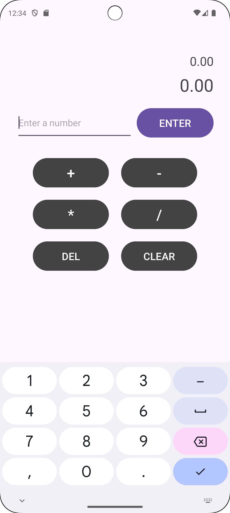

# Android RPN Calculator
https://github.com/natewilliford/rpn-calc-android

[Take home exercise explanation](https://github.com/snap-mobile/take-home-exercise)

This is a simple
[Reverse Polish notation](https://en.wikipedia.org/wiki/Reverse_Polish_notation) calculator Android app. In RPN all operands are entered before the operator is selected.

## UI

Numbers can be typed into the field and then entered into the calculator's stack for future operatons. The app only shows the previous 2 values that the calculator can do operations on, but the full stack is much larger allowing for entering long expressions.

DEL deletes previous items one at a time, and CLEAR resets everything.

## Architecture

The simple app contains only a single Activity with a single [Fragment](https://github.com/natewilliford/rpn-calc-android/blob/main/app/src/main/java/com/natewilliford/rpncalculator/RpnCalcFragment.java) as well as a [ViewModel](https://github.com/natewilliford/rpn-calc-android/blob/main/app/src/main/java/com/natewilliford/rpncalculator/RpnCalcFragmentViewModel.java) to handle business logic and saved state. LiveData objects are used to notify the UI of changes.

The actual calculator logic is done in the dedicated [RpnCalculator](https://github.com/natewilliford/rpn-calc-android/blob/main/app/src/main/java/com/natewilliford/rpncalculator/RpnCalculator.java) class. This was made as if this class could be included as a library and used anywhere, so I chose to keep it simple and separated and not too opinionated.

The calculator's state is persisted to SavedStateHandle in the ViewModel if for some reason the app is suspended.

## Trade-offs & Improvements

This is an entirely Java based app with xml layouts. I chose Java purely because of my familiarity with, but if I was working on an app needing to be maintained going forward I would choose Kotlin and probably Compose for the UI as that seems to be the more supported path going farward. Kotlin would provide some conveniences particularly with null checking. The Main UI uses a ConstraintLayout to allow for some complexity in the layout without needing to nest views (which tends to be bad for performance).

I made a decision to allow operations on the entered text even if it hasn't been explicitly "entered" into the calculator. I think this makes sense from a UX perspective as it is how I would expect a physical calculator to work. However this added a bit of logic to the Fragment where previously almost all business logic was contained in the ViewModel. If I were to do this again, I'd consider taking more of a reactive approach and store the input text as state in the ViewModel as the user types it in. It would allow almost all the logic to be contained in the ViewModel, and has the added benefit of being able to easily save the input value in saved state as well.

I'm allowing divide-by-zero and Infinity, NaN operations. I considered handling it as an error, but in testing it seems to work somewhat as expected.

Similarly, I'm not explicitly checking for overflow. In Java Double seems to overflow to Infinity.

I did error handling entirely using exceptions. Part of my reasoning is that considering RpnCalculator kind of as a standalone library, exceptions are just idiomatic Java and what I would expect to see. As long as they are all documented I don't think they are too scary. An alternative might be using some sort of error codes, but that might complicate some of the function signtures. I needed to handle one or two other system exceptions as well anyway.

Unit tests of the core calculator logic are included, but I would also probably include Robolectric tests of the ViewModel and maybe Fragment as well if I were to maintain this project going forward. Dagger/Hilt would have helped with that.

## How to Run

Built using AndroidStudio 2023.2.1 with target sdk 34. Any newish version of AS should work.
Clone the repo, sync gradle, and run in an emulator like normal.

https://github.com/natewilliford/rpn-calc-android